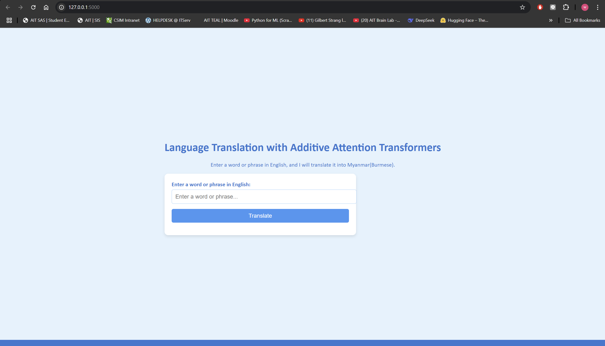
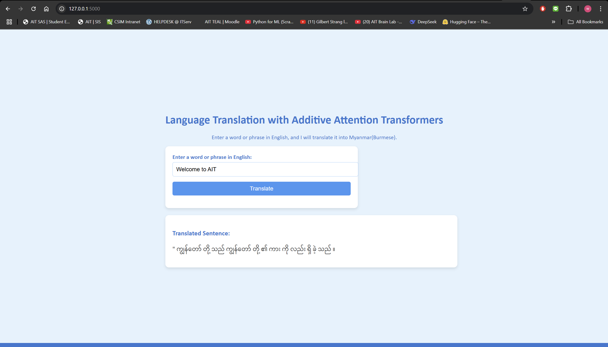

# A3: MM-to-EN-Language-Translator
Enjoy reading my A3 Assignment for NLP class.

## Author Info
Name: WIN MYINT@HTET WAI YAN HTUT (WILLIAM)
Student ID: st125326

## Task 1.1: Find relevant Dataset (1 points)
1. As a Myanmar Nationality, I choose ENGLISH - MYANMAR text pair as my dataset.
2. I obtained my dataset from https://www2.nict.go.jp/astrec-att/member/mutiyama/ALT/
3. The copyright holder of the translations of the ALT Parallel Corpus is the National Institute of Information and Communications Technology, Japan (NICT). 
4. The University of Computer Studies, Yangon, Myanmar helped NICT translate the English texts into the Myanmar texts.

## Task 1.2: Detailed process of dataset preparation (1 points)
1.  Initially the dataset contains english and multiple Asian language pairs. I firstly split it into English and Myanmar pair.
2. ENGLISH tokenization done using spacy tokenizer with the en_core_web_sm model.
3. MYANMAR tokenization done using custom tokenizer for Myanmar using the Viterbi algorithm for word segmentation. This is a sophisticated approach and well-suited for Myanmar, which requires word segmentation. (Full credit to Dr. Ye Kyaw Thu for the Viterbi algorithm implementation. [https://github.com/ye-kyaw-thu/myWord] )
4. Vocabulary buidling: Tokenized English and Myanmar text are used to build a vocabulary. The vocabulary is then used to convert text into numerical indices for further processing.

## Task 2: Experiment with Attention Mechanisms( General, Multiplicative, Additive) (1.5 points)

1. Comparison of Different Attention Models

| Attention Model Names | Training Loss | Training PPL | Validation Loss | Validation PPL | Training Time |
|-----------------------|---------------|--------------|-----------------|----------------|---------------|
| General Attention      | 4.200         | 66.714       | 5.214           | 183.789        | 9m 31s        |
| Multiplicative Attention | 4.206         | 67.083       | 5.194           | 180.127        | 10m 27s       |
| Additive Attention     | 4.161         | 64.144       | 5.187           | 178.845        | 10m 11s       |

## Task 3: Evaluation and Verification (2.5 points)
1. Best Accuracy: additiveAttention 
2. additiveAttention achieves the lowest best train loss at 4.161.
3. additiveAttention achieves the lowest best train PPL at
4. additiveAttention achieves the lowest best validation loss at 5.187.
5. additiveAttention achieves the lowest best validation PPL at 178.845.
6. Computational Efficiency: generalAttention takes 9m 31s to train, which is the fastest.
7. Train loss and Validation loss graph for all models

8. Attention Maps for General Attention

9. Attention Maps for Multiplicative Attention

10. Attention Maps for Additive Attention

11. Final Analysis
- Original sentence: Italy have defeated Portugal 31-5 in Pool C of the 2007 Rugby World Cup at Parc des Princes, Paris, France.

- MY Translation by General attention: နိုင်ငံ၏ဝင်ကတွင်မြို့ကန်မှုလူခုနှစ်တွင်လလာတွင်လူသည်။ကိုလည်း၁၏ယောက်ဖြင့်စီတွင်လူခဲ့ခဲ့သည်။နေ

- MY Translation by Multiplicative attention: 
နိုင်ငံတွင်ဝင်ပါတွင်မြို့နိုင်ငံနှစ်ပိုင်းခုနှစ်တွင်များလာတွင်၊သည်။ကိုလည်း၁နှစ်ယောက်ဖြင့်၊စီတွင်၊ခဲ့ခဲ့သည်။တွင်

- MY Translation by Addtitive attention: 
နိုင်ငံတွင်ဝင်ပါတွင်ကဲ-နိုင်ငံတွင်ရှိခုနှစ်တွင်ရှိလာတွင်ရှိသည်။ကိုမ၆နှစ်နာရီဖြင့်ရှိစီ)ရှိခဲ့ခဲ့သည်။ရ

- The datset trained has been reduced to be able to train on my laptop GPU so the translation made are unsurprisingly not so accurate in real world translation scenario.

## Task 4: Web App (2 points)
How to run the web app
1. Pull the github repository
2. Run
```sh
python app/app.py
```
3. Access the app using http://127.0.0.1:5000

## How to use website
1. Open a web browser and navigate to http://127.0.0.1:5000.
2. Enter the text you want to translate in the input field.
3. Click the "Translate" button to get the translated text.
4. View the translated text in the output field.

## Screenshot of my web app



## documentation on how the web application interfaces with the language model for machine translation.
This web application showcases a machine translation system that translates English text into Myanmar using a Transformer-based model with an Additive Attention mechanism. The model is deployed through a Flask web application and uses the trained language model to generate translations in real-time.